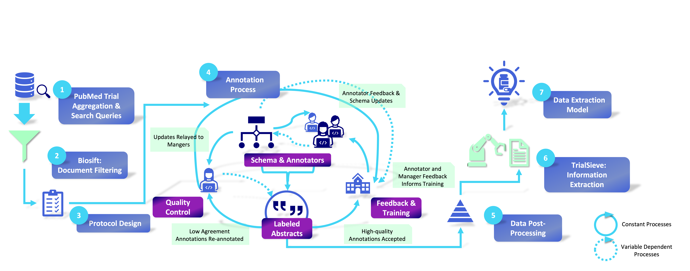

# TrialSieve
NER on clinical cohort studies for automated meta-analysis of clinical literature.  

This repository will be updated on a rolling basis as new annoatations are processed.



# Data
All data for `TrialSieve` can be found in the `data` subdirectory.  The data files contained are as follows:
* `pmid_title_abstract.csv`: File containing PubMedID, title, and abstract of each document in TrialSieve.  Note that both title and abstract were annotated.
* `final_schema_data.csv`: Annotations made using the most up-to-date schema as described in our paper.
* `old_schema_data.csv`: Annotations made using previous versions of the schema
* `all_data.csv`: All annotations merged together, regardless of schema
* `preprocessed_for_modeling.json` Preprocessed data from final schema to be used with NER models


# Reproducing Experiments
## Environment setup
Create and activate the conda environment by running
```bash
conda env create -f environment.yaml 
conda activate trialsieve
```

## Running Models
To run the models, run the following from the main directory:
```bash
python models/train.py
```

